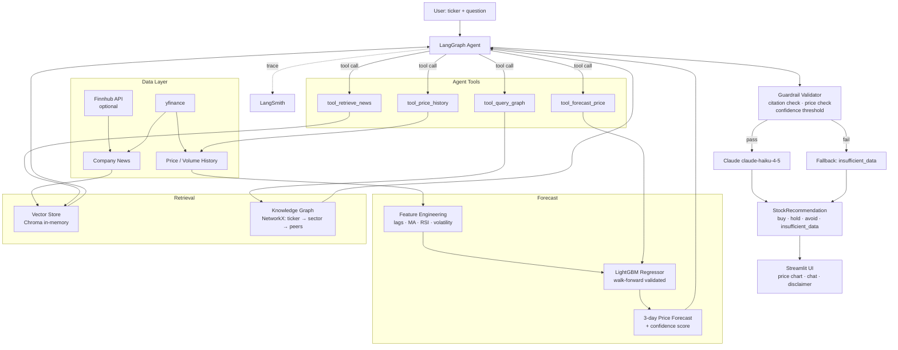

# Architecture

## Components

| Layer | What it does | Key file |
|---|---|---|
| **Data** | Price history via yfinance; news via Finnhub (falls back to yfinance) | `data/data_layer.py` |
| **Forecast** | LightGBM regressor with lag/MA/RSI features, walk-forward backtested | `forecast/forecaster.py` |
| **Vector store** | Chroma in-memory store; news embedded and retrieved by semantic similarity | `retrieval/vector_store.py` |
| **Knowledge graph** | NetworkX graph of ticker → sector → peer companies | `retrieval/knowledge_graph.py` |
| **Agent tools** | 4 LangChain tools the agent can call: forecast, news, graph, price history | `agent/tools.py` |
| **Guardrails** | 3-layer hallucination mitigation: system prompt + Pydantic schema + code validator | `agent/guardrails.py` |
| **Agent** | LangGraph ReAct loop; LangSmith tracing wired in from the start | `agent/agent.py` |
| **UI** | Streamlit: ticker input, close price chart, chat interface, persistent disclaimer | `app.py` |
