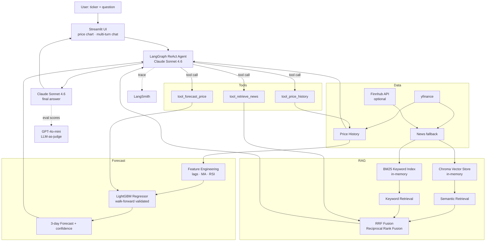

# Stock RAG Recommendation Agent

A portfolio/demo project that combines price forecasting, hybrid RAG over news, and a
multi-turn conversational interface to answer stock research questions.

> ⚠️ **NOT FINANCIAL ADVICE** — for educational and demo purposes only.

🚀 **Live demo:** [stock-rag-recommendation-agent.onrender.com](https://stock-rag-recommendation-agent.onrender.com)

---

## Architecture



## Components

| Layer | What it does | Key file |
|---|---|---|
| **Data** | Price history + news via yfinance; Finnhub optional | `data/data_layer.py` |
| **Forecast** | LightGBM with lag/MA/RSI features, walk-forward backtested | `forecast/forecaster.py` |
| **Vector store** | Chroma in-memory (semantic) + BM25 (keyword), fused via RRF | `retrieval/vector_store.py` |
| **Agent tools** | 3 LangChain tools: forecast · news RAG · price history | `agent/tools.py` |
| **Agent** | LangGraph ReAct loop with multi-turn memory; LangSmith tracing | `agent/agent.py` |
| **Evals** | 4 LLM-as-judge metrics via GPT-4o-mini (context relevance, coverage, faithfulness, answer relevance) | `evals/metrics.py` |
| **UI** | Streamlit: ticker input, price chart, persistent multi-turn chat, eval scores expander | `app.py` |

---


## Project structure

```
├── app.py                       # Streamlit UI
├── data/
│   └── data_layer.py            # yfinance price + news (Finnhub optional)
├── forecast/
│   └── forecaster.py            # LightGBM 3-day-ahead price forecaster
├── retrieval/
│   └── vector_store.py          # Hybrid Chroma + BM25 + RRF retrieval
├── agent/
│   ├── tools.py                 # LangChain tools (forecast, retrieve, price history)
│   └── agent.py                 # LangGraph ReAct agent (Claude Sonnet 4.6)
├── evals/
│   └── metrics.py               # LLM-as-judge eval metrics (GPT-4o-mini)
├── requirements.txt
└── .env.example
```

## Setup

```bash
# 1. Clone & create a virtual environment
python -m venv .venv && source .venv/bin/activate

# 2. Install dependencies
pip install -r requirements.txt

# 3. Copy and fill in your API keys
cp .env.example .env
#   → FINNHUB_API_KEY  (free at finnhub.io)
#   → ANTHROPIC_API_KEY
#   → LANGSMITH_API_KEY  (optional, enables tracing)

# 4. Run
streamlit run app.py
```

## How it works

1. **Data layer** — fetches OHLCV price history and news from yfinance (Finnhub optional).
2. **Forecaster** — engineers lag/MA/RSI features, trains a LightGBM model with walk-forward validation, and returns a 3-day-ahead price prediction with a confidence score.
3. **Hybrid RAG** — news is indexed into both Chroma (semantic) and BM25 (keyword); results are merged via Reciprocal Rank Fusion (RRF) for best-of-both retrieval.
4. **Agent** — LangGraph ReAct loop with Claude Sonnet 4.6 calls tools, grounds every answer in retrieved news and forecast data, supports multi-turn chat.
5. **Evals** — after each RAG response, GPT-4o-mini scores 4 metrics (context relevance, context coverage, faithfulness, answer relevance) displayed inline in the UI.
6. **LangSmith** — every run and tool call is traced automatically when `LANGSMITH_API_KEY` is set.
   when `LANGSMITH_API_KEY` is set.
