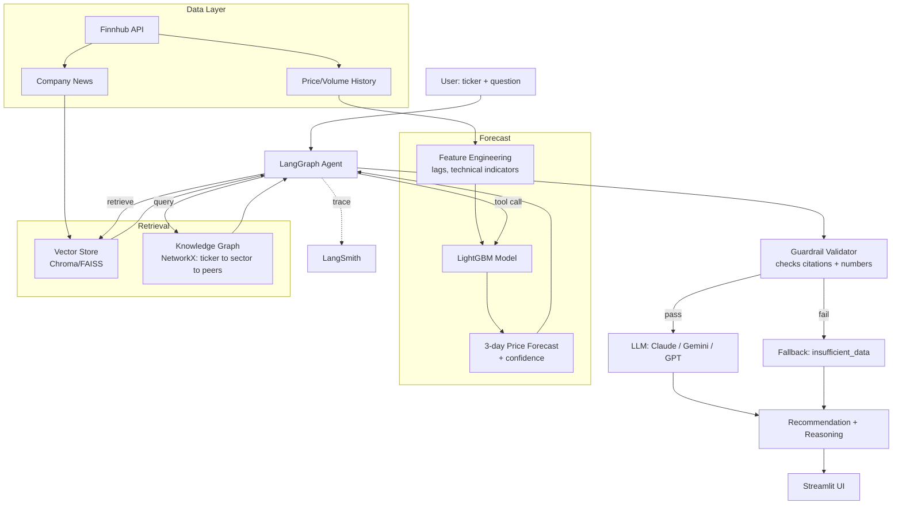

# Stock RAG Recommendation Agent — Project Plan

## 1. Goal

A periodically-refreshable agent that, given a stock ticker, combines a short-horizon
price forecast with retrieved news/context (vector RAG) and a knowledge graph
(sector/peer relationships) to produce a grounded **buy / hold / avoid** recommendation
with cited reasoning — via a multi-turn conversational interface, observable through
LangSmith, deployed on Streamlit.

This is a portfolio/demo project, not a production trading system. The UI will carry
a visible "not financial advice" disclaimer at all times.

## 2. Architecture overview

## 3. Components

### 3.1 Data layer
- **Source:** Finnhub API (free tier: 60 calls/min) — covers both OHLCV price history
  and company news in a single provider/key.
- **Design:** fetch functions wrapped behind a small interface (`get_price_history(ticker)`,
  `get_news(ticker)`) so the provider can be swapped later without touching the rest
  of the system.
- **Refresh:** designed to be called periodically (e.g. daily cron/schedule), not just
  on-demand — each run pulls the latest prices and news.

### 3.2 Forecasting model
- **Approach:** classical/ML, not deep learning — LightGBM regressor.
- **Features:** lagged prices/volume, rolling technical indicators (moving averages,
  RSI, volatility).
- **Target:** 3-day-ahead price.
- **Validation:** walk-forward backtesting (not a random train/test split — time series
  needs chronological splits).
- **Output:** point forecast + a confidence score, both consumed downstream.
- **Exposure:** wrapped as a callable tool (`forecast_price(ticker)`) that the LLM
  invokes through the agent, not called directly by the user.

### 3.3 Retrieval (RAG)
- **Corpus:** recent Finnhub news per ticker, chunked and embedded into a vector store
  (Chroma or FAISS).
- **V2 expansion:** SEC EDGAR filing excerpts added to the corpus for deeper grounding.

### 3.4 Knowledge graph
- **MVP:** lightweight graph in NetworkX — nodes for ticker, sector, peer companies,
  and news events; edges for "belongs to," "competes with," "mentioned in."
- **Purpose:** answers questions vector RAG alone can't ("how does this compare to
  its sector peers this week?").
- **V2 consideration:** migrate to Neo4j if the graph or query complexity outgrows
  NetworkX.

### 3.5 Agent orchestration
- **Framework:** LangGraph — explicit graph of retrieve → forecast tool call →
  guardrail validation → LLM synthesis, with persistent state for multi-turn
  conversation (follow-up questions re-use prior context and can trigger new
  retrieval).

### 3.6 Guardrails (hallucination mitigation)
Three layers, already prototyped in `guardrails.py`:
1. Grounding system prompt — explicit citation rules, permission to answer
   "insufficient_data."
2. Structured output schema (`StockRecommendation`) — forces the LLM to commit to
   specific, checkable fields (forecast value used, sources cited).
3. Code-level validator — cross-checks cited sources against what was actually
   retrieved, checks forecast numbers against the tool's real output, and blocks
   confident recommendations when forecast confidence is low.

Failed validations fall back to a safe "insufficient data" response rather than
surfacing an unverified claim.

### 3.7 LLM layer
- **MVP:** single provider (Claude) to get the full loop working end-to-end.
- **V2:** add Gemini and GPT behind the same interface; use LangSmith to compare
  traces, latency, cost, and recommendation consistency across all three on the
  same queries.

### 3.8 Observability
- **LangSmith:** wired in from the start, not bolted on later. Every agent run,
  tool call, retrieval, and guardrail violation is traced. Guardrail failures get
  logged as labeled examples to build an eval set over time.

### 3.9 UI & deployment
- **UI:** Streamlit — ticker input, forecast chart, chat-style recommendation
  output, persistent disclaimer banner.
- **Deployment:** Streamlit Community Cloud (free), link shared with a small group.

## 4. Tech stack

| Layer | Choice |
|---|---|
| Data API | Finnhub |
| Forecast model | LightGBM |
| Vector store | Chroma or FAISS |
| Knowledge graph | NetworkX (MVP) → Neo4j (V2, if needed) |
| Agent framework | LangGraph |
| LLMs | Claude (MVP) → + Gemini, GPT (V2) |
| Observability | LangSmith |
| UI | Streamlit |
| Deployment | Streamlit Community Cloud |

## 5. Roadmap

### MVP
- [ ] Finnhub data layer (price history + news), swappable interface
- [ ] Feature engineering + LightGBM forecaster, walk-forward backtested
- [ ] Vector store over Finnhub news
- [ ] NetworkX knowledge graph (ticker/sector/peers)
- [ ] LangGraph agent: retrieve → forecast tool → guardrail validation → LLM synthesis
- [ ] Guardrails module integrated (grounding prompt + schema + validator)
- [ ] LangSmith tracing on every run
- [ ] Streamlit UI with disclaimer, single-LLM (Claude)
- [ ] Deploy to Streamlit Community Cloud, share link

### V2
- [ ] Multi-turn conversational memory (follow-ups trigger re-retrieval)
- [ ] Add Gemini + GPT, common interface, LangSmith side-by-side comparison
- [ ] Expand RAG corpus with SEC EDGAR filings
- [ ] Guardrail-violation eval set from LangSmith logs
- [ ] Migrate knowledge graph to Neo4j if warranted

### Stretch
- [ ] Multi-ticker / portfolio-level view
- [ ] LSTM/Transformer forecast variant, compared against LightGBM
- [ ] Scheduled background refresh (not just on-demand queries)

## 6. Risks / open items

- **Finnhub reliability:** free tier is rate-limited (60/min) — fine for demo traffic,
  worth caching responses during development to avoid burning quota.
- **Disclaimer:** since this will be shared with other people and outputs buy/avoid
  language, the "not financial advice" disclaimer needs to be persistent in the UI,
  not just in the system prompt.
- **Graph scope creep:** NetworkX is fine for a small, mostly-static ticker/sector/peer
  graph; if the graph needs to grow dynamically or support complex traversal queries,
  that's the trigger to move to Neo4j rather than doing it preemptively.
